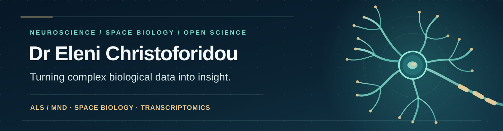

<!--
  GitHub profile README for github.com/eleni-chr
  Place the accompanying SVG in assets/neuroscience-header.svg.
  The six linked repositories below are public; the three upcoming repositories are not yet linked.
-->

  

   

  
<strong>Neuroscientist (PhD) · Post-doctoral Research Fellow, University of Sussex</strong>

  
<strong>9</strong> research publications &nbsp;·&nbsp; <strong>5</strong> archived software releases &nbsp;·&nbsp; <strong>2</strong> public RNA-seq datasets

  
  
  
  

---

### 👋 About me

I am **Dr Eleni Christoforidou**, a neuroscientist investigating **amyotrophic lateral sclerosis / motor neuron disease (ALS/MND)** through molecular biology, transcriptomics and quantitative imaging. I develop computational tools and analysis pipelines to make complex biological data interpretable, from confocal microscopy to high-throughput sequencing.

I am also expanding into **computational space biology** as a **complementary research area**, by analysing spaceflight datasets from NASA.

Across both areas, I value **open science, reproducible workflows and transparent quantitative methods**.

### 🔬 Research areas

| 🧠 Neurodegeneration | 🧬 Molecular & RNA biology |
| :--- | :--- |
| ALS/MND, motor neurons, neuromuscular junctions, skeletal muscle | RNA-seq, microRNA biomarkers, alternative polyadenylation, gene regulation |
| **🛰️ Computational space biology** | **🔍 Quantitative imaging** |
| Spaceflight omics, microgravity-associated changes, mechanical unloading and recovery | Confocal microscopy, cell morphometry, fluorescence localisation, spatial statistics |

### ✨ Open research software

<table>
<tr>
<td width="50%" valign="top">
  <h3>🧠 <a href="https://github.com/eleni-chr/NMJ-MN-image-analysis-toolkit">NMJ &amp; motor-neuron imaging toolkit</a></h3>
  
Morphometric analysis of neuromuscular junctions and protein localisation in microscopy images.

  <code>MATLAB</code> <code>Image analysis</code> <code>NMJ</code>
</td>
<td width="50%" valign="top">
  <h3>🔬 <a href="https://github.com/eleni-chr/interneuron-microscopy-analysis">Spinal-cord interneuron analysis</a></h3>
  
An ImageJ/Fiji and MATLAB pipeline for interneuron density and spatial-distribution analysis.

  <code>MATLAB</code> <code>ImageJ</code> <code>Spatial statistics</code>
</td>
</tr>
<tr>
<td width="50%" valign="top">
  <h3>🧬 <a href="https://github.com/eleni-chr/long-read-RNA-seq-plotting-suite">Long-read RNA-seq toolkit</a></h3>
  
Functions for sequencing-data inspection, extraction, processing and visualisation.

  <code>MATLAB</code> <code>RNA-seq</code> <code>Bioinformatics</code>
</td>
<td width="50%" valign="top">
  <h3>📊 <a href="https://github.com/eleni-chr/qPCR-replicate-analysis">qPCR replicate analysis</a></h3>
  
Statistical workflows for assessing Ct consistency and reliability across technical replicates.

  <code>MATLAB</code> <code>Statistics</code> <code>Reproducibility</code>
</td>
</tr>
<tr>
<td width="50%" valign="top">
  <h3>🧫 <a href="https://github.com/eleni-chr/cell-morphometry">Cell morphometry</a></h3>
  
Extracts quantitative measurements of cell shape, including area, circularity and other descriptors.

  <code>MATLAB</code> <code>Microscopy</code>
</td>
<td width="50%" valign="top">
  <h3>🎯 <a href="https://github.com/eleni-chr/colocalisation">Fluorescence colocalisation</a></h3>
  
Measures pixel-based colocalisation between colour channels in confocal microscopy images.

  <code>MATLAB</code> <code>Image processing</code>
</td>
</tr>
</table>

Research code comes with project-specific documentation. Some workflows were developed for particular datasets and may require adaptation before reuse.

### 🚀 Upcoming research repositories

The following analyses underpin manuscripts I have written. **Their code repositories are being prepared for public release**; links will be added once available.

| Project | Analysis and methods |
| :--- | :--- |
| **🛰️ ALS muscle × spaceflight & mechanical unloading** Repository coming soon · Space biology + neuroscience | Comparative transcriptomics of ALS skeletal muscle, NASA spaceflight experiments and ground-based unloading/reloading models. Differential expression, pathway enrichment, cross-dataset concordance and reversible gene-expression programmes. |
| **🧬 Alternative polyadenylation in TDP-43 muscle** Repository coming soon · RNA biology | Analysis of changes in 3′-UTR usage, mRNA expression and microRNA-associated regulation across disease stages in a TDP-43 mouse model of ALS. |
| **🩸 Circulating microRNA biomarkers in ALS** Repository coming soon · Translational transcriptomics | Longitudinal analysis of plasma microRNA profiles and assessment of candidate biomarkers across independent clinical sample cohorts, including plasma/serum cross-cohort comparisons. |

### 🛠️ Scientific computing toolkit

**Languages and environments**

**Methods and interests**

`RNA-seq` · `microRNA analysis` · `Alternative polyadenylation` · `DESeq2` · `GSEA / pathway enrichment` · `NASA OSDR data` · `Confocal microscopy` · `Image processing` · `Statistical analysis` · `Reproducible workflows`

### 📖 Publications and open research

My work sits at the intersection of **neuroscience, molecular biology and computational analysis**, with a developing complementary focus on **space biology**. Where possible, I share analytical code, document methods and archive reusable research outputs.

- 📚 **Peer-reviewed work:** [Publications](https://www.elenichr.com/publications) · [ORCID](https://orcid.org/0000-0002-9352-4908)
- 🧬 **Open sequencing datasets:** [PRJEB96186](https://www.ebi.ac.uk/ena/browser/view/PRJEB96186) · [PRJEB61796](https://www.ebi.ac.uk/ena/browser/view/PRJEB61796) (European Nucleotide Archive)
- 📦 **Citable research software:** the [NMJ imaging toolkit](https://github.com/eleni-chr/NMJ-MN-image-analysis-toolkit), [cell morphometry](https://github.com/eleni-chr/cell-morphometry) and other repositories include Zenodo DOI links.
- 🌐 **More about my work:** [Research experience](https://www.elenichr.com/research-experience) · [Coding experience](https://www.elenichr.com/coding-experience)

### 🤝 Connect

Interested in **ALS/MND, space biology, quantitative imaging, research software or reproducible omics analysis**? Find me on [LinkedIn](https://www.linkedin.com/in/elenichristoforidou/) or through [my website](https://www.elenichr.com/). I also share accessible science content at [@neuroscientist.at.work](https://www.instagram.com/neuroscientist.at.work/).

---

  Research-driven code. Reproducible methods. Open scientific exchange.

